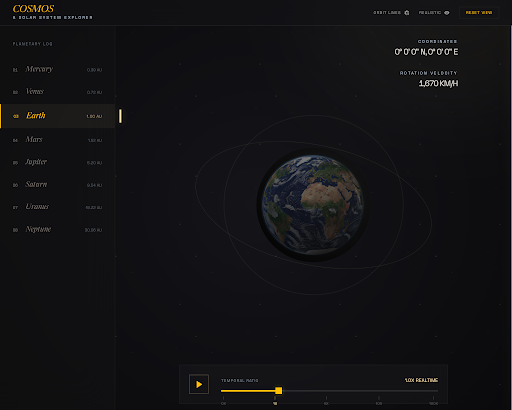

# COSMOS — A Solar System Explorer

An interactive 3D solar system explorer, built with Three.js and real NASA
data. Drag to orbit, click a planet to focus, scrub the time slider to
speed up or pause orbital motion.



## Run locally

No build step. Any static server works.

```bash
# Option 1: VS Code Live Server (right-click index.html → Open with Live Server)

# Option 2: Python
python -m http.server 8000

# Option 3: Node
npx serve .
```

Then open `http://localhost:8000`.

## Deploy

This folder is GitHub-Pages-ready. Push it to a repo and enable Pages on
the branch root. No asset rewriting needed.

## Controls

| Action                     | Input                                      |
| -------------------------- | ------------------------------------------ |
| Orbit camera               | Mouse drag                                 |
| Zoom                       | Scroll / pinch                             |
| Pan                        | Right-mouse drag                           |
| Focus a planet             | Click planet or planet name in the left nav |
| Deselect                   | `ESC` or click empty space                 |
| Time speed                 | Slider at bottom (0× → 10×)                |
| Play / Pause               | Icon beside slider                         |
| Orbit paths                | Top-right toggle                           |
| Realistic scale            | Top-right toggle                           |
| Reset view                 | Top-right button                           |

## Project structure

```
Cosmos/
├── index.html
├── styles/
│   └── styles.css
├── scripts/
│   ├── main.js              Three.js scene, custom orbit controls, UI
│   └── planet-data.json     NASA-sourced planetary data
├── images/
│   ├── hero-backdrop.png    Nano Banana 2
│   ├── sun-texture.jpg      Nano Banana 2
│   ├── mercury.jpg … neptune.jpg
│   └── favicon.png
└── design/
    └── stitch/              Google Stitch UI mockups
        ├── 01-hud.png
        ├── 02-info-panel.png
        └── 03-time-controls.png
```

## Design system

- **Palette:** near-black `#0a0d12`, warm bone-white ink `#f5ecdf`, muted cool
  blue `#6f89a8`, single warm amber accent `#d9a05b`
- **Typography:** Instrument Serif (display) + JetBrains Mono (data) —
  delivered via Google Fonts
- **Motion:** `cubic-bezier(0.22, 1, 0.36, 1)` glide curve; 2s camera
  transitions, 550ms panel slide, 220ms hover

## Tools used (pipeline)

| Tool                | Purpose                                                  |
| ------------------- | -------------------------------------------------------- |
| WebFetch            | Scraped 8 NASA planetary facts pages (Firecrawl unavailable in env) |
| Nano Banana 2       | Generated 11 images — sun + 8 planet textures + backdrop + favicon |
| Google Stitch       | 3 UI mockups: HUD overlay, info panel, time-control cluster |
| 21st.dev Magic      | Slider / component inspiration references                |
| UI UX Pro Max skill | Design-system lock-down: palette, type pairing, motion   |
| Three.js r128       | 3D rendering                                             |

## Data

All planetary data is scraped from NASA's public science pages at
`science.nasa.gov/<planet>/facts/`. Physical constants not published on
the facts pages (mass, gravity, average surface temperature) are filled
from NASA's Planetary Fact Sheet at
`nssdc.gsfc.nasa.gov/planetary/factsheet`.

Data © NASA.

## Credits

- **3D engine:** [Three.js](https://threejs.org/) r128
- **Data:** NASA Science / NSSDC
- **Fonts:** [Instrument Serif](https://fonts.google.com/specimen/Instrument+Serif),
  [JetBrains Mono](https://fonts.google.com/specimen/JetBrains+Mono)
- **Textures + backdrop + favicon:** Generated with Nano Banana 2
  (Google Gemini 3.1 Flash Image Preview) via inference.sh
- **UI mockups:** Google Stitch
- **Component references:** 21st.dev Magic
- **Design system:** UI UX Pro Max

## License

MIT for the code. NASA data is in the public domain.
